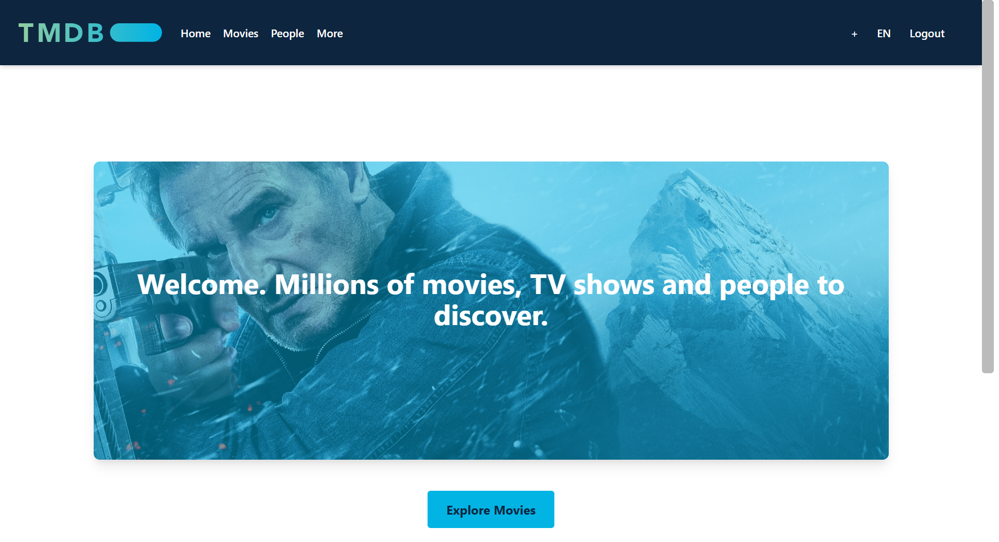

# 🎬 MoviesApp

[](https://youtu.be/cuts4il1za8)

A modern web application built with **React** and **Vite** that allows users to explore movies using **The Movie Database (TMDb) API** with **Supabase authentication**.

## You need to register to be able to navigate, if you don't want to register you can also use this: email: carlos@test.com pw: carlos1234

## ✨ Features

- 🎭 Browse popular movies from TMDb
- 🔐 Secure authentication with Supabase (login/logout)
- 🛡️ Protected routes for movie listing and user profile
- 🏗️ Clean project structure with reusable components
- ⚙️ Environment-based configuration for API keys
- 📱 Responsive design

---

## 🛠 Tech Stack

- **Frontend:** React 19 + Vite
- **Language:** TypeScript (optional, supported)
- **Routing:** React Router DOM
- **HTTP Client:** Axios
- **Authentication & Backend:** Supabase
- **Styling:** Tailwind

---

## 🚀 Getting Started

### Prerequisites

- Node.js (version 16 or higher)
- npm
- TMDb API account
- Supabase project

### Installation

1. **Clone the repository**

   ```bash
   git clone https://github.com/your-username/moviesapp.git

   ```

2. **Install dependencies**

   ```bash
   npm install
   ```

3. **Set up environment variables**

   Create a `.env` file in the root directory:

   ```env
   VITE_TMDB_API_KEY=your_tmdb_api_key
   VITE_SUPABASE_URL=your_supabase_url
   VITE_SUPABASE_ANON_KEY=your_supabase_anon_key
   ```

   > **Note:** You can get your TMDb API key from [TMDb API](https://www.themoviedb.org/settings/api) and Supabase credentials from your [Supabase Dashboard](https://app.supabase.com/).

4. **Start the development server**

   ```bash
   npm run dev
   ```

5. **Open your browser** and navigate to `http://localhost:5173`

---

## 🧠 Key Learning Points

- ⚡ Setting up a modern React project with Vite for fast development
- 🔌 Using Axios interceptors to automatically include API keys in requests
- 🔐 Implementing authentication flows with Supabase (login, logout, sessions)
- 🛡️ Setting up protected routes with React Router
- 🌐 Integrating external APIs (TMDb) with backend services (Supabase)
- 🧪 Writing and running tests with Vitest for component testing

---
